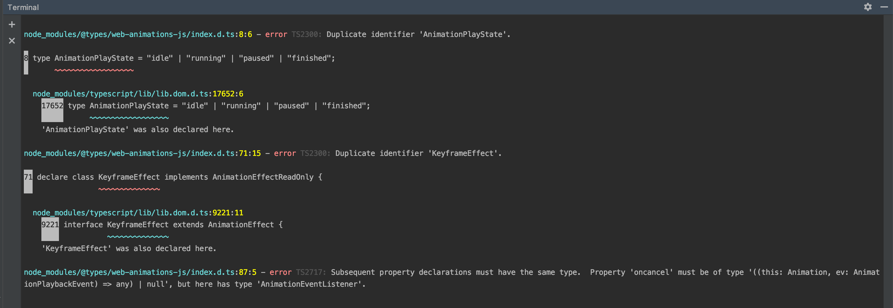
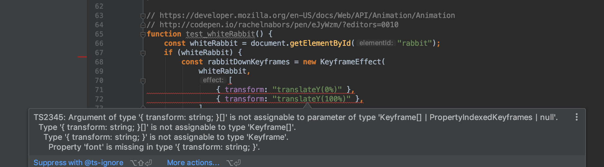

# 3.Мультимедиа

## Как запустить:
- запустить тестовые видео потоки: https://github.com/mad-gooze/shri-2018-2-multimedia-homework/blob/master/streams/README.md

- npm i
- npm start
- multimedia.html

## Описание

JS-файлы лежат в папке sstv. Задание тестировалось на iOS девайсах

При наведении мышкой на видео появляется маленький плюсик сверху для увеличения видео. При клике на этот плюсик открывается попап с контролами контрастности и яркости(фильтры к видео накладываются с помощью CSS) и также информация о громкости видео в виде столбчатой диаграммы (элемент canvas)

# Типизация

## Как запустить:

никак, в библиотеке web-animation-js содержится большое количество конфликтов с TS версии 3.1.3

Кроме того, нельзя создать анимации с помощью функции animate, вот часть кода из файлов с тестами из репозитория @types/web-animation-js

Возможно, проблема в том, что свойства типа, который принимает KeyFrame, являются обязательными или им указали неверный generic тип Record вместо нужного Partial.
